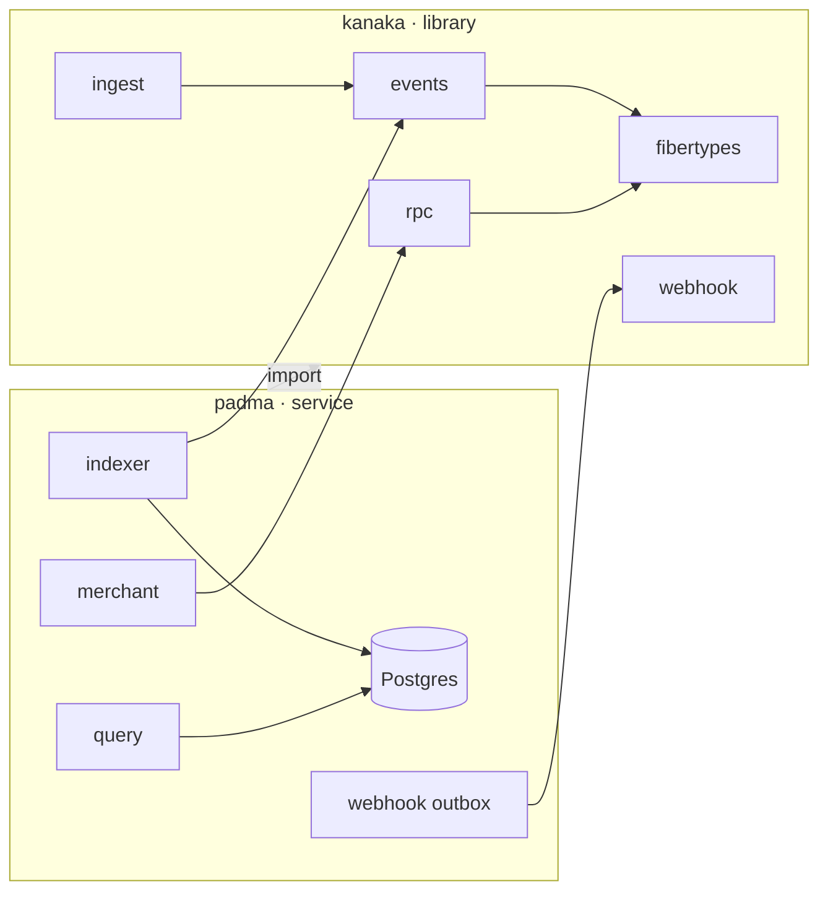
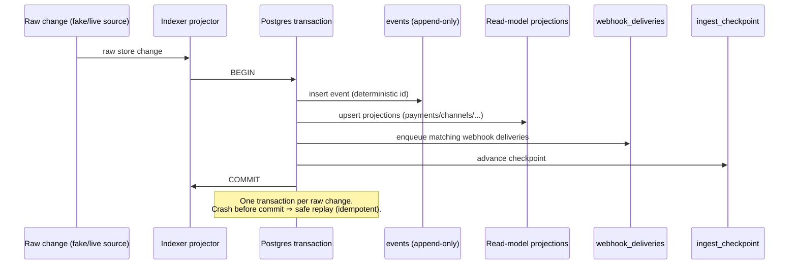

# Architecture

`padma` never re-implements the plumbing it gets from `kanaka`. The library
supplies the machine; the service supplies the policy — Postgres, business
rules, and HTTP routes.

## The library/service split

| From `kanaka` | `padma` uses it for |
| -------------- | -------------------- |
| `rpc.Client` | create invoices, send refunds |
| `ingest.Runner` + `Source` | drive the event stream |
| `events.Normalizer` + `Event` | raw store change → semantic event |
| `webhook.Sign` / `Verify` | sign outbound deliveries |
| `webhook.Dispatcher` | the retry/backoff/dead-letter engine |

And `padma` implements the interfaces `kanaka` leaves open:

| Library interface | `padma` implementation |
| ------------------ | ------------------------ |
| `ingest.Checkpoint` | `indexer` → `ingest_checkpoint` table |
| `webhook.Store` | `PostgresDeliveryStore` → `webhook_deliveries` outbox (SKIP LOCKED) |

Library = machine + interfaces. Service = Postgres + business logic. No
duplication — `kanaka` and `padma` are separate concerns living in separate
repositories.

## Dependency flow

## Two load-bearing details

!!! note "Transactional outbox"
    For each raw change, the projector writes the append-only `events` row,
    updates the read-model projections, enqueues matching `webhook_deliveries`,
    and advances the checkpoint — all in **one transaction**. A crash simply
    replays the whole change; deterministic ids make the write idempotent.

!!! note "SKIP-LOCKED delivery"
    `PostgresDeliveryStore.ClaimDue` uses `SELECT … FOR UPDATE SKIP LOCKED`, so
    any number of dispatcher workers claim disjoint batches with no
    double-send. Attempts are counted at `MarkFailed` / `MarkDead` time to stay
    aligned with the library's dead-letter logic.

## The transactional outbox, step by step

